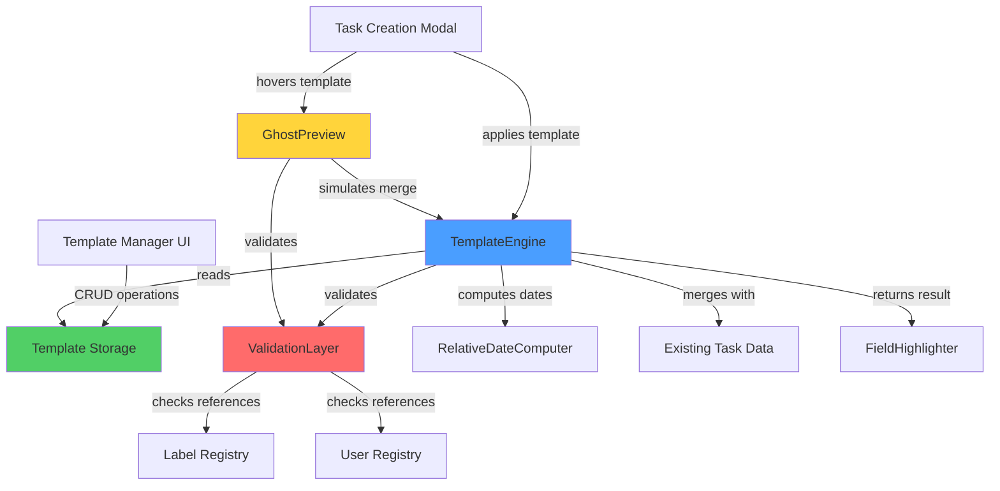

# Design Document: Task Templating System

## Overview

The Task Templating System provides a comprehensive solution for creating, managing, and applying reusable task templates within the SoroTask application. The system consists of three primary components:

1. **TemplateEngine**: A core utility class responsible for template application, validation, and relative date computation
2. **UI Components**: React-based interfaces for template selection (integrated into Task Creation Modal) and template management
3. **Validation Layer**: A robust validation system that ensures template integrity and handles graceful degradation

The system is designed to meet strict performance requirements (<100ms template application) while maintaining data integrity and providing an intuitive user experience. Templates support dynamic field prefilling (title, description, labels, assignee), relative date rules, and three-tier scoping (User, Project, Workspace).

### Key Design Goals

- **Performance**: Template application completes in <100ms through optimized data structures and minimal DOM operations
- **Reliability**: 95%+ test coverage with comprehensive property-based testing for validation logic
- **Usability**: Seamless integration with existing task creation workflow, visual feedback for prefilled fields
- **Flexibility**: Support for partial template application with graceful degradation when references are invalid
- **Maintainability**: Clear separation of concerns between engine logic, validation, and UI presentation

## Architecture

### System Components



### Component Responsibilities

**TemplateEngine**
- Orchestrates template application workflow
- Coordinates validation, date computation, and field merging
- Enforces scope-based access control
- Provides atomic template application operations

**ValidationLayer**
- Verifies template JSON structure integrity
- Validates label and assignee references
- Checks relative date rule validity
- Returns detailed validation results with field-level feedback

**RelativeDateComputer**
- Computes due dates from relative date rules
- Handles day-based offsets from application time
- Formats dates in ISO 8601 format
- No weekend/holiday adjustment (uses computed date as-is)

**Template Storage**
- Persists templates in JSON format
- Supports efficient scope-based filtering
- Provides CRUD operations with optimistic updates
- Implements indexing for fast template lookup

**UI Components**
- **TemplateSelector**: Dropdown/command palette in Task Creation Modal with hover preview
- **GhostPreview**: Translucent preview overlay showing template application result
- **TemplateManager**: Dedicated settings page for template CRUD
- **FieldHighlighter**: Visual feedback system with animations for prefilled fields

### Data Flow

1. **Template Application Flow**:
   ```
   User selects template → TemplateEngine.apply() → ValidationLayer.validate() →
   RelativeDateComputer.compute() → Merge with existing data → Update UI with highlights
   ```

2. **Template Management Flow**:
   ```
   User opens Template Manager → Load templates by scope → User performs CRUD →
   Validate template structure → Save to storage → Update UI
   ```

3. **Scope Filtering Flow**:
   ```
   Determine current context (User/Project/Workspace) → Query templates by scope →
   Filter by permissions → Return accessible templates
   ```

## Components and Interfaces

### TemplateEngine Class

```typescript
interface Template {
  id: string;
  name: string;
  description?: string;
  scope: 'User' | 'Project' | 'Workspace';
  scopeId: string; // userId, projectId, or workspaceId
  fields: {
    title?: string;
    description?: string;
    labels?: string[]; // label IDs
    assignee?: string; // user ID
  };
  relativeDateRule?: {
    offsetDays: number;
  };
  createdAt: string; // ISO 8601
  updatedAt: string; // ISO 8601
  createdBy: string; // user ID
}

interface TemplateApplicationResult {
  success: boolean;
  appliedFields: string[];
  skippedFields: Array<{
    field: string;
    reason: string;
  }>;
  warnings: string[];
}

class TemplateEngine {
  /**
   * Apply a template to task data, merging with existing values
   * @param template - The template to apply
   * @param existingData - Current task form data
   * @param context - Current user/project/workspace context
   * @returns Result indicating success and any skipped fields
   */
  apply(
    template: Template,
    existingData: Partial<TaskData>,
    context: ApplicationContext
  ): TemplateApplicationResult;

  /**
   * Validate template structure and references
   * @param template - Template to validate
   * @param context - Current context for reference validation
   * @returns Validation result with field-level errors
   */
  validate(template: Template, context: ApplicationContext): ValidationResult;

  /**
   * Parse JSON string into Template object
   * @param json - JSON string representation
   * @returns Parsed template or error
   */
  parse(json: string): Result<Template, ParseError>;

  /**
   * Serialize Template object to JSON string
   * @param template - Template to serialize
   * @returns JSON string representation
   */
  serialize(template: Template): string;

  /**
   * Get templates accessible in current context
   * @param context - Current user/project/workspace context
   * @returns Filtered list of accessible templates
   */
  getAccessibleTemplates(context: ApplicationContext): Template[];
}
```

### ValidationLayer Interface

```typescript
interface ValidationResult {
  valid: boolean;
  errors: ValidationError[];
  fieldResults: Map<string, FieldValidationResult>;
}

interface FieldValidationResult {
  valid: boolean;
  exists: boolean;
  accessible: boolean;
  message?: string;
}

interface ValidationError {
  field: string;
  code: string;
  message: string;
}

class ValidationLayer {
  /**
   * Validate all template fields and references
   */
  validateTemplate(template: Template, context: ApplicationContext): ValidationResult;

  /**
   * Validate label references exist and are accessible
   */
  validateLabels(labelIds: string[], context: ApplicationContext): FieldValidationResult;

  /**
   * Validate assignee exists and is active
   */
  validateAssignee(userId: string, context: ApplicationContext): FieldValidationResult;

  /**
   * Validate relative date rule produces valid future date
   */
  validateRelativeDateRule(rule: RelativeDateRule): FieldValidationResult;

  /**
   * Validate template JSON structure
   */
  validateStructure(template: unknown): ValidationResult;
}
```

### RelativeDateComputer Interface

```typescript
interface RelativeDateRule {
  offsetDays: number; // Positive or negative integer offset from application time
}

class RelativeDateComputer {
  /**
   * Compute due date from relative date rule
   * @param rule - Relative date specification with offset from application time
   * @param baseDate - Base date for computation (defaults to now)
   * @returns ISO 8601 formatted date string
   * 
   * @example
   * // Template applied on Dec 10, 2024 with offsetDays: 3
   * compute({ offsetDays: 3 }, new Date('2024-12-10'))
   * // Returns: '2024-12-13T00:00:00Z'
   * 
   * @remarks
   * This design makes templates "evergreen" - they remain useful indefinitely
   * because dates are calculated relative to application time, not stored as
   * static dates that become stale.
   */
  compute(rule: RelativeDateRule, baseDate?: Date): string;

  /**
   * Validate that a relative date rule is well-formed
   */
  isValid(rule: RelativeDateRule): boolean;
}
```

### UI Component Interfaces

```typescript
// Template Selector Component (in Task Creation Modal)
interface TemplateSelectorProps {
  context: ApplicationContext;
  onTemplateSelect: (template: Template) => void;
  onTemplateHover: (template: Template | null) => void;
  currentTaskData: Partial<TaskData>;
}

// Template Manager Component
interface TemplateManagerProps {
  context: ApplicationContext;
}

interface TemplateManagerState {
  templates: Template[];
  selectedTemplate: Template | null;
  searchQuery: string;
  scopeFilter: 'All' | 'User' | 'Project' | 'Workspace';
  isEditing: boolean;
}

// Field Highlighter Component
interface FieldHighlighterProps {
  fieldName: string;
  isPrefilled: boolean;
  highlightDuration: number; // milliseconds (default: 2000)
  animationType: 'fade' | 'pulse' | 'slide'; // animation style
}

// Ghost Preview Component
interface GhostPreviewProps {
  template: Template | null;
  currentTaskData: Partial<TaskData>;
  context: ApplicationContext;
}

interface GhostPreviewState {
  previewData: TaskData;
  mergeResult: {
    fieldsToFill: string[];
    fieldsToPreserve: string[];
    fieldsToSkip: string[];
  };
}
```

## Data Models

### Template Storage Schema

Templates are stored as JSON documents with the following structure:

```json
{
  "id": "tmpl_abc123",
  "name": "Bug Report Template",
  "description": "Standard template for bug reports",
  "scope": "Workspace",
  "scopeId": "ws_xyz789",
  "fields": {
    "title": "Bug: ",
    "description": "## Steps to Reproduce\n\n1. \n\n## Expected Behavior\n\n\n## Actual Behavior\n\n",
    "labels": ["lbl_bug", "lbl_needs_triage"],
    "assignee": "user_123"
  },
  "relativeDateRule": {
    "offsetDays": 7
  },
  "createdAt": "2024-01-15T10:30:00Z",
  "updatedAt": "2024-01-15T10:30:00Z",
  "createdBy": "user_456"
}
```

### Complete JSON Schema Documentation

**Schema Definition**:

```typescript
interface TemplateSchema {
  // Required fields
  id: string;                    // Unique identifier (format: "tmpl_<random>")
  name: string;                  // Display name (1-100 characters)
  scope: 'User' | 'Project' | 'Workspace';  // Visibility scope
  scopeId: string;               // ID of the scope entity (userId, projectId, or workspaceId)
  fields: TemplateFields;        // Prefill values for task fields
  createdAt: string;             // ISO 8601 timestamp
  updatedAt: string;             // ISO 8601 timestamp
  createdBy: string;             // User ID of creator
  
  // Optional fields
  description?: string;          // Template description (0-500 characters)
  relativeDateRule?: {           // Relative date calculation
    offsetDays: number;          // Integer offset from application time (can be negative)
  };
}

interface TemplateFields {
  title?: string;                // Prefill for task title (0-200 characters)
  description?: string;          // Prefill for task description (0-2000 characters)
  labels?: string[];             // Array of label IDs (0-10 labels)
  assignee?: string;             // User ID for task assignee
}
```

**Extensibility Design**:
- New fields can be added to `TemplateFields` without breaking existing templates
- Unknown fields in parsed JSON are preserved but ignored during application
- Schema version field can be added in future for migrations
- All optional fields default to undefined when omitted

**Examples by Scope Type**:

**User-Scoped Template** (visible only to creator):
```json
{
  "id": "tmpl_user_001",
  "name": "My Daily Standup Notes",
  "description": "Personal template for daily standup preparation",
  "scope": "User",
  "scopeId": "user_alice_123",
  "fields": {
    "title": "Standup - ",
    "description": "## Yesterday\n\n## Today\n\n## Blockers\n\n",
    "labels": ["lbl_personal"]
  },
  "relativeDateRule": {
    "offsetDays": 0
  },
  "createdAt": "2024-01-15T10:30:00Z",
  "updatedAt": "2024-01-15T10:30:00Z",
  "createdBy": "user_alice_123"
}
```

**Project-Scoped Template** (visible to all project members):
```json
{
  "id": "tmpl_proj_001",
  "name": "Feature Request",
  "description": "Template for new feature requests in Project Alpha",
  "scope": "Project",
  "scopeId": "proj_alpha_456",
  "fields": {
    "title": "[Feature] ",
    "description": "## Problem Statement\n\n## Proposed Solution\n\n## Acceptance Criteria\n\n",
    "labels": ["lbl_feature", "lbl_needs_review"],
    "assignee": "user_product_manager"
  },
  "relativeDateRule": {
    "offsetDays": 14
  },
  "createdAt": "2024-01-15T10:30:00Z",
  "updatedAt": "2024-01-15T10:30:00Z",
  "createdBy": "user_alice_123"
}
```

**Workspace-Scoped Template** (visible to all workspace members):
```json
{
  "id": "tmpl_ws_001",
  "name": "Security Incident Report",
  "description": "Company-wide template for security incidents",
  "scope": "Workspace",
  "scopeId": "ws_acme_corp",
  "fields": {
    "title": "[SECURITY] ",
    "description": "## Incident Summary\n\n## Impact Assessment\n\n## Immediate Actions Taken\n\n## Root Cause\n\n## Prevention Plan\n\n",
    "labels": ["lbl_security", "lbl_urgent", "lbl_incident"],
    "assignee": "user_security_lead"
  },
  "relativeDateRule": {
    "offsetDays": 1
  },
  "createdAt": "2024-01-15T10:30:00Z",
  "updatedAt": "2024-01-15T10:30:00Z",
  "createdBy": "user_security_admin"
}
```

**Template with Minimal Fields** (all optional fields omitted):
```json
{
  "id": "tmpl_minimal_001",
  "name": "Quick Task",
  "scope": "User",
  "scopeId": "user_bob_789",
  "fields": {
    "title": "TODO: "
  },
  "createdAt": "2024-01-15T10:30:00Z",
  "updatedAt": "2024-01-15T10:30:00Z",
  "createdBy": "user_bob_789"
}
```

**Relative Date Rule Behavior**:
- `offsetDays: 0` → Due date = application date (today)
- `offsetDays: 3` → Due date = 3 days from application date
- `offsetDays: -7` → Due date = 7 days before application date (for retrospective tasks)
- Omitted `relativeDateRule` → No due date set by template

### Storage Implementation

**Frontend Storage**: Templates are stored in browser localStorage with the following structure:

```typescript
interface TemplateStore {
  templates: Record<string, Template>; // keyed by template ID
  indices: {
    byScope: Record<string, string[]>; // scope -> template IDs
    byUser: Record<string, string[]>; // user ID -> template IDs
    byProject: Record<string, string[]>; // project ID -> template IDs
  };
  version: string; // schema version for migrations
}
```

**Performance Optimizations**:
- Templates indexed by scope for O(1) filtering
- In-memory cache of frequently accessed templates
- Lazy loading of template list (load IDs first, full data on demand)
- Debounced search with client-side filtering

### Task Data Model

```typescript
interface TaskData {
  id?: string;
  title: string;
  description: string;
  labels: string[]; // label IDs
  assignee?: string; // user ID
  dueDate?: string; // ISO 8601
  status: 'open' | 'in_progress' | 'completed';
  createdAt: string;
  updatedAt: string;
  projectId?: string;
  workspaceId: string;
}
```

### Application Context Model

```typescript
interface ApplicationContext {
  userId: string;
  workspaceId: string;
  projectId?: string;
  availableLabels: Label[];
  availableUsers: User[];
  permissions: {
    canCreateWorkspaceTemplates: boolean;
    canCreateProjectTemplates: boolean;
  };
}

interface Label {
  id: string;
  name: string;
  color: string;
  projectId?: string;
  workspaceId: string;
}

interface User {
  id: string;
  name: string;
  email: string;
  active: boolean;
}
```

### Smart Merge Strategy

The template application system uses a smart merge strategy that prioritizes user-entered data over template values. This ensures users never lose work when applying templates.

**Merge Priority Rules**:

1. **Title Field**:
   - If user has entered a title → Keep user's title (template title ignored)
   - If title is empty → Fill from template
   - Rationale: Title is often the first thing users type; overwriting would be disruptive

2. **Description Field**:
   - If user has entered a description → Append template description with separator
   - If description is empty → Fill from template
   - Separator format: `\n\n---\n\n` (visual break between user and template content)
   - Rationale: Both user and template descriptions may contain valuable content

3. **Labels Field**:
   - Always merge: Union of user labels and template labels
   - Remove duplicates (by label ID)
   - Preserve order: user labels first, then template labels
   - Rationale: Labels are additive; more labels provide better categorization

4. **Assignee Field**:
   - If user has selected an assignee → Keep user's assignee (template assignee ignored)
   - If no assignee selected → Fill from template
   - Rationale: Assignee is a deliberate choice; overwriting would be confusing

5. **Due Date Field**:
   - If user has set a due date → Keep user's due date (template date ignored)
   - If no due date set → Compute from template's relativeDateRule
   - Rationale: User-specified dates take precedence over template calculations

**Implementation Algorithm**:

```typescript
function mergeTemplateWithExistingData(
  template: Template,
  existingData: Partial<TaskData>,
  context: ApplicationContext
): TaskData {
  const result: Partial<TaskData> = { ...existingData };
  
  // Title: preserve if non-empty
  if (!existingData.title || existingData.title.trim() === '') {
    result.title = template.fields.title || '';
  }
  
  // Description: append if both exist
  if (template.fields.description) {
    if (existingData.description && existingData.description.trim() !== '') {
      result.description = existingData.description + '\n\n---\n\n' + template.fields.description;
    } else {
      result.description = template.fields.description;
    }
  }
  
  // Labels: union without duplicates
  if (template.fields.labels) {
    const existingLabels = existingData.labels || [];
    const templateLabels = template.fields.labels.filter(
      labelId => context.availableLabels.some(l => l.id === labelId)
    );
    result.labels = [...new Set([...existingLabels, ...templateLabels])];
  }
  
  // Assignee: preserve if set
  if (!existingData.assignee && template.fields.assignee) {
    const assigneeExists = context.availableUsers.some(
      u => u.id === template.fields.assignee && u.active
    );
    if (assigneeExists) {
      result.assignee = template.fields.assignee;
    }
  }
  
  // Due date: compute if not set
  if (!existingData.dueDate && template.relativeDateRule) {
    result.dueDate = RelativeDateComputer.compute(template.relativeDateRule);
  }
  
  return result as TaskData;
}
```

**Merge Result Tracking**:

The merge operation returns metadata about what was applied:

```typescript
interface MergeResult {
  appliedFields: string[];      // Fields filled from template
  preservedFields: string[];    // Fields kept from user input
  skippedFields: Array<{        // Fields not applied due to validation
    field: string;
    reason: string;
  }>;
  warnings: string[];           // Non-critical issues (e.g., deleted labels)
}
```

### Ghost Preview System

The Ghost Preview provides a visual preview of what the task will look like after template application, helping users make informed decisions before committing.

**Preview Trigger**:
- Activated when user hovers over a template name in the dropdown
- Debounced by 300ms to avoid flickering during mouse movement
- Dismissed when mouse leaves template area or user selects a template

**Preview Rendering**:

The preview shows a "skeleton" or "ghost" version of the task form with:
- Dimmed/translucent styling (opacity: 0.6) to indicate preview state
- Template values rendered in their respective fields
- Merge indicators showing which fields will be filled vs. preserved
- Color coding:
  - Green highlight: Fields that will be filled from template
  - Blue highlight: Fields that will be preserved from user input
  - Yellow highlight: Fields that will be merged (description, labels)
  - Red highlight: Fields that will be skipped due to validation errors

**Preview Component Structure**:

```typescript
interface GhostPreviewData {
  previewTitle: string;
  previewDescription: string;
  previewLabels: Array<{ id: string; name: string; color: string }>;
  previewAssignee: { id: string; name: string } | null;
  previewDueDate: string | null;
  
  fieldStates: {
    title: 'fill' | 'preserve' | 'merge' | 'skip';
    description: 'fill' | 'preserve' | 'merge' | 'skip';
    labels: 'fill' | 'preserve' | 'merge' | 'skip';
    assignee: 'fill' | 'preserve' | 'merge' | 'skip';
    dueDate: 'fill' | 'preserve' | 'merge' | 'skip';
  };
  
  validationWarnings: string[];
}

function generateGhostPreview(
  template: Template,
  currentData: Partial<TaskData>,
  context: ApplicationContext
): GhostPreviewData {
  // Simulate merge operation
  const mergeResult = mergeTemplateWithExistingData(template, currentData, context);
  
  // Determine field states
  const fieldStates = {
    title: determineFieldState('title', template, currentData),
    description: determineFieldState('description', template, currentData),
    labels: determineFieldState('labels', template, currentData),
    assignee: determineFieldState('assignee', template, currentData),
    dueDate: determineFieldState('dueDate', template, currentData),
  };
  
  // Validate and collect warnings
  const validation = ValidationLayer.validate(template, context);
  
  return {
    previewTitle: mergeResult.title,
    previewDescription: mergeResult.description,
    previewLabels: resolveLabels(mergeResult.labels, context),
    previewAssignee: resolveAssignee(mergeResult.assignee, context),
    previewDueDate: mergeResult.dueDate,
    fieldStates,
    validationWarnings: validation.errors.map(e => e.message),
  };
}
```

**Preview UI Layout**:

```
┌─────────────────────────────────────┐
│ Template: Bug Report Template       │
│ ─────────────────────────────────── │
│ Title: [Bug: ] ← will fill          │
│ Description: [template text] ← fill │
│ Labels: [bug, triage] ← will fill   │
│ Assignee: @john ← will fill         │
│ Due Date: Dec 17, 2024 ← computed   │
│                                     │
│ ⚠ Note: 1 label no longer exists    │
└─────────────────────────────────────┘
```

**Performance Considerations**:
- Preview computation must complete in <50ms to feel instant
- Cache validation results for templates to avoid repeated checks
- Use React.memo() to prevent unnecessary re-renders
- Debounce hover events to reduce computation frequency

### Enhanced Visual Feedback System

The visual feedback system provides clear, non-intrusive indicators when template fields are applied, helping users understand what was automated.

**Highlight Behavior**:

1. **Trigger**: Highlights activate immediately after successful template application
2. **Duration**: Default 2000ms (configurable per field type)
3. **Animation Types**:
   - **Fade**: Smooth opacity transition from highlighted to normal (default)
   - **Pulse**: Gentle scale animation that draws attention
   - **Slide**: Subtle slide-in effect for newly filled fields

4. **Color Coding**:
   - Green (#51cf66): Field filled from template
   - Blue (#4a9eff): Field preserved from user input (shown in preview only)
   - Yellow (#ffd43b): Field merged (description, labels)

**Implementation Details**:

```typescript
interface HighlightConfig {
  duration: number;           // milliseconds
  animationType: 'fade' | 'pulse' | 'slide';
  color: string;              // hex color code
  intensity: number;          // 0.0 to 1.0 (opacity multiplier)
}

const defaultHighlightConfigs: Record<string, HighlightConfig> = {
  title: { duration: 2000, animationType: 'fade', color: '#51cf66', intensity: 0.3 },
  description: { duration: 2500, animationType: 'fade', color: '#51cf66', intensity: 0.3 },
  labels: { duration: 2000, animationType: 'pulse', color: '#51cf66', intensity: 0.4 },
  assignee: { duration: 2000, animationType: 'fade', color: '#51cf66', intensity: 0.3 },
  dueDate: { duration: 2000, animationType: 'fade', color: '#51cf66', intensity: 0.3 },
};

class FieldHighlighter {
  private activeHighlights: Map<string, NodeJS.Timeout> = new Map();
  
  /**
   * Apply highlight animation to a field
   * @param fieldName - Name of the field to highlight
   * @param config - Highlight configuration (uses default if not provided)
   */
  highlight(fieldName: string, config?: Partial<HighlightConfig>): void {
    // Clear existing highlight if present
    this.clearHighlight(fieldName);
    
    const finalConfig = { ...defaultHighlightConfigs[fieldName], ...config };
    const element = document.querySelector(`[data-field="${fieldName}"]`);
    
    if (!element) return;
    
    // Apply highlight class with animation
    element.classList.add('field-highlighted');
    element.style.setProperty('--highlight-color', finalConfig.color);
    element.style.setProperty('--highlight-intensity', finalConfig.intensity.toString());
    element.style.setProperty('--animation-type', finalConfig.animationType);
    
    // Schedule removal
    const timeout = setTimeout(() => {
      element.classList.remove('field-highlighted');
      this.activeHighlights.delete(fieldName);
    }, finalConfig.duration);
    
    this.activeHighlights.set(fieldName, timeout);
  }
  
  /**
   * Clear highlight from a field immediately
   */
  clearHighlight(fieldName: string): void {
    const timeout = this.activeHighlights.get(fieldName);
    if (timeout) {
      clearTimeout(timeout);
      this.activeHighlights.delete(fieldName);
    }
    
    const element = document.querySelector(`[data-field="${fieldName}"]`);
    if (element) {
      element.classList.remove('field-highlighted');
    }
  }
  
  /**
   * Clear all active highlights
   */
  clearAll(): void {
    for (const fieldName of this.activeHighlights.keys()) {
      this.clearHighlight(fieldName);
    }
  }
}
```

**CSS Animation Definitions**:

```css
.field-highlighted {
  position: relative;
  transition: background-color 0.3s ease-in-out;
}

.field-highlighted[style*="--animation-type: fade"] {
  background-color: var(--highlight-color);
  opacity: var(--highlight-intensity);
  animation: fadeOut var(--highlight-duration, 2000ms) ease-in-out forwards;
}

.field-highlighted[style*="--animation-type: pulse"] {
  animation: pulse 0.6s ease-in-out 3;
}

.field-highlighted[style*="--animation-type: slide"] {
  animation: slideIn 0.4s ease-out;
}

@keyframes fadeOut {
  0% { opacity: var(--highlight-intensity); }
  70% { opacity: var(--highlight-intensity); }
  100% { opacity: 0; }
}

@keyframes pulse {
  0%, 100% { transform: scale(1); }
  50% { transform: scale(1.02); }
}

@keyframes slideIn {
  0% { transform: translateX(-10px); opacity: 0; }
  100% { transform: translateX(0); opacity: 1; }
}
```

**Accessibility Considerations**:
- Respect `prefers-reduced-motion` media query (disable animations if set)
- Provide screen reader announcements for applied fields
- Ensure sufficient color contrast for highlights
- Don't rely solely on color to convey information (use icons/text as well)


## Correctness Properties

*A property is a characteristic or behavior that should hold true across all valid executions of a system-essentially, a formal statement about what the system should do. Properties serve as the bridge between human-readable specifications and machine-verifiable correctness guarantees.*

### Property 1: Template Serialization Round-Trip

*For any* valid Template object, serializing to JSON then parsing back to an object then serializing again should produce an equivalent JSON string.

**Validates: Requirements 1.4, 12.1, 12.3, 12.4**

### Property 2: Relative Date Computation Correctness

*For any* Relative_Date_Rule with a positive or negative offset in days and any base date, the computed due date should equal the base date plus the offset days, without weekend or holiday adjustment, formatted in ISO 8601.

**Validates: Requirements 1.2, 8.1, 8.2, 8.3, 8.4**

### Property 3: Template Scope Field Validity

*For any* valid Template object, the scope field must be exactly one of "User", "Project", or "Workspace".

**Validates: Requirements 1.3**

### Property 4: Template Structure Validation

*For any* JSON object, if it is validated as a template, then it must contain all required fields (id, name, scope, scopeId, fields, createdAt, updatedAt, createdBy) with correct types.

**Validates: Requirements 1.5, 5.4**

### Property 5: Atomic Template Application

*For any* template application operation, if an error occurs during validation or field application, then either all fields are applied successfully or no fields are applied (no partial state).

**Validates: Requirements 2.2**

### Property 6: Scope-Based Template Filtering

*For any* application context and set of templates, all templates returned by getAccessibleTemplates() must be accessible according to scope rules: User-scoped templates visible only to creator, Project-scoped templates visible to all project members, Workspace-scoped templates visible to all workspace members.

**Validates: Requirements 3.3, 9.1, 9.2, 9.3, 9.4**

### Property 7: Search Query Matching

*For any* search query string and set of templates, all templates returned by the search function must contain the query string (case-insensitive) in either the template name or description.

**Validates: Requirements 4.5**

### Property 8: Scope Filter Correctness

*For any* scope filter value (User, Project, or Workspace) and set of templates, all templates returned must have a scope field matching the filter value.

**Validates: Requirements 4.6**

### Property 9: Label Reference Validation

*For any* template with label references and application context, the validation layer must verify each label ID exists in the context's available labels and mark the field as invalid if any label is missing.

**Validates: Requirements 5.1**

### Property 10: Assignee Reference Validation

*For any* template with an assignee reference and application context, the validation layer must verify the user ID exists in the context's available users and the user is active, marking the field as invalid if the user is missing or inactive.

**Validates: Requirements 5.2**

### Property 11: Relative Date Rule Validation

*For any* Relative_Date_Rule, the validation layer must verify that the offsetDays is a valid integer and that computing the date from the current time produces a valid date object.

**Validates: Requirements 5.3**

### Property 12: Graceful Degradation with Invalid References

*For any* template with one or more invalid references (deleted labels or inactive assignees) and valid remaining fields, the template application must succeed, skip only the invalid fields, apply all valid fields, and return success with a list of skipped fields.

**Validates: Requirements 6.1, 6.2, 6.4**

### Property 13: Skipped Field Notification

*For any* template application that skips one or more fields due to invalid references, the result must include a warning message for each skipped field identifying the field name and reason.

**Validates: Requirements 6.3**

### Property 14: Title Preservation on Merge

*For any* template with a title field and existing task data with a non-empty title, applying the template must preserve the existing title and not overwrite it with the template title.

**Validates: Requirements 7.1**

### Property 15: Description Append on Merge

*For any* template with a description field and existing task data with a non-empty description, applying the template must append the template description to the existing description (with appropriate separator).

**Validates: Requirements 7.2**

### Property 16: Label Union on Merge

*For any* template with labels and existing task data with labels, applying the template must produce a label set that is the union of both sets without duplicates.

**Validates: Requirements 7.3**

### Property 17: Assignee Preservation on Merge

*For any* template with an assignee field and existing task data with an assignee, applying the template must preserve the existing assignee and not overwrite it with the template assignee.

**Validates: Requirements 7.4**

### Property 18: Invalid JSON Parse Error

*For any* invalid JSON string provided to the parse function, the function must return an error result with a descriptive error message rather than throwing an exception.

**Validates: Requirements 12.2**

### Property 19: Ghost Preview Merge Simulation Accuracy

*For any* template and existing task data, the ghost preview's simulated merge result must exactly match the actual merge result that would occur if the template were applied.

**Validates: Ghost Preview System**

### Property 20: Field Highlight Animation Timing

*For any* template application that fills one or more fields, the field highlighter must display visual feedback for exactly the configured duration (default 2000ms) before returning to normal state.

**Validates: Enhanced Visual Feedback**

### Property 21: Relative Date Offset Storage

*For any* template with a relative date rule, the stored offsetDays value must be an integer, and computing the due date at any future application time T must produce T + offsetDays.

**Validates: Relative Date Rules Enhancement**

### Property 22: Smart Merge Never Overwrites User Data

*For any* template application where the user has entered data in a field (title, assignee, or due date), the merge operation must preserve the user's value and not overwrite it with the template value.

**Validates: Smart Merge Strategy**

### Property 23: Description Merge Preserves Both Contents

*For any* template with a description and existing task data with a non-empty description, the merged description must contain both the user's original description and the template description, separated by a clear delimiter.

**Validates: Smart Merge Strategy**

### Property 24: Label Merge Produces Union Without Duplicates

*For any* template with labels and existing task data with labels, the merged label set must contain all unique labels from both sources with no duplicates (by label ID).

**Validates: Smart Merge Strategy**

## Error Handling

### Error Categories

The system handles four categories of errors:

1. **Validation Errors**: Template structure or reference validation failures
2. **Parse Errors**: Invalid JSON or malformed template data
3. **Permission Errors**: Scope-based access violations
4. **System Errors**: Storage failures or unexpected runtime errors

### Error Handling Strategy

**Validation Errors**
- Return structured ValidationResult with field-level error details
- Allow partial application with graceful degradation
- Provide user-friendly error messages for each validation failure
- Log validation failures for debugging

**Parse Errors**
- Catch JSON parsing exceptions and convert to Result type
- Return descriptive error messages indicating the parse failure location
- Never throw exceptions to the UI layer
- Validate schema after successful JSON parse

**Permission Errors**
- Filter templates by scope before returning to UI
- Return empty list rather than error for insufficient permissions
- Log permission violations for security auditing
- Provide clear feedback when user attempts to access restricted templates

**System Errors**
- Wrap storage operations in try-catch blocks
- Return error results rather than throwing exceptions
- Provide fallback behavior (e.g., return cached data on storage failure)
- Log all system errors with full context for debugging

### Error Recovery

**Template Application Failures**
- Roll back any partial changes if atomic operation fails
- Preserve existing task data on application failure
- Display error notification with actionable guidance
- Allow user to retry with corrected template

**Storage Failures**
- Retry failed operations with exponential backoff (max 3 attempts)
- Fall back to in-memory cache if localStorage is unavailable
- Warn user about unsaved changes
- Provide export functionality to save templates externally

**Reference Validation Failures**
- Skip invalid fields and continue with valid fields
- Collect all validation warnings and display in single notification
- Provide option to edit template to fix invalid references
- Log validation failures for template quality monitoring

## Testing Strategy

### Dual Testing Approach

The Task Templating System requires both unit tests and property-based tests for comprehensive coverage:

**Unit Tests** focus on:
- Specific examples of template application (e.g., applying a bug report template)
- UI component rendering and interaction (e.g., template selector dropdown)
- Edge cases like empty templates, null fields, and boundary conditions
- Integration points between TemplateEngine and ValidationLayer
- Error handling for specific failure scenarios

**Property-Based Tests** focus on:
- Universal properties that hold for all inputs (e.g., round-trip serialization)
- Validation logic across randomly generated templates
- Merge behavior with various combinations of existing and template data
- Scope filtering with random user/project/workspace contexts
- Date computation with random offset values

Together, these approaches provide comprehensive coverage: unit tests catch concrete bugs in specific scenarios, while property tests verify general correctness across the input space.

### Property-Based Testing Configuration

**Library Selection**: Use `fast-check` for TypeScript/JavaScript property-based testing

**Test Configuration**:
- Minimum 100 iterations per property test (due to randomization)
- Each property test must reference its design document property
- Tag format: `// Feature: task-templating-system, Property {number}: {property_text}`

**Example Property Test Structure**:

```typescript
import fc from 'fast-check';

// Feature: task-templating-system, Property 1: Template Serialization Round-Trip
test('template serialization round-trip preserves data', () => {
  fc.assert(
    fc.property(
      templateArbitrary(), // custom generator for valid templates
      (template) => {
        const json1 = TemplateEngine.serialize(template);
        const parsed = TemplateEngine.parse(json1);
        expect(parsed.success).toBe(true);
        const json2 = TemplateEngine.serialize(parsed.value);
        expect(json2).toEqual(json1);
      }
    ),
    { numRuns: 100 }
  );
});
```

### Test Coverage Requirements

**Coverage Targets**:
- Overall code coverage: 95%+
- TemplateEngine class: 100%
- ValidationLayer class: 100%
- RelativeDateComputer class: 100%
- UI components: 85%+ (excluding pure presentation logic)

**Critical Test Scenarios**:

1. **Template Application with Manual Input**
   - Apply template to task with pre-filled title
   - Apply template to task with pre-filled description
   - Apply template to task with existing labels
   - Apply template to task with existing assignee
   - Apply template to task with existing due date

2. **Smart Merge Strategy**
   - Verify title preservation when user has entered text
   - Verify description append with correct separator
   - Verify label union without duplicates
   - Verify assignee preservation when already set
   - Verify due date preservation when already set

3. **Ghost Preview Accuracy**
   - Preview matches actual merge result for all field combinations
   - Preview updates within 50ms of hover
   - Preview dismisses correctly on mouse leave
   - Preview shows validation warnings for invalid references

4. **Relative Date Calculations**
   - Positive offset produces future date
   - Negative offset produces past date
   - Zero offset produces current date
   - Large offsets (>365 days) compute correctly
   - Date format is valid ISO 8601

5. **Templates with Null Optional Fields**
   - Template with no description
   - Template with no labels
   - Template with no assignee
   - Template with no relative date rule

6. **Permission-Based Scenarios**
   - User accessing templates in projects they don't belong to
   - User creating workspace templates without permission
   - User editing templates they didn't create

7. **Visual Feedback**
   - Field highlights appear immediately after template application
   - Highlights persist for configured duration
   - Multiple fields can be highlighted simultaneously
   - Highlight animations don't interfere with user input

8. **Edge Cases**
   - Empty template (no fields set)
   - Template with all fields set to empty strings
   - Template with very long text fields (>10KB)
   - Template with invalid date offsets (negative, zero, very large)
   - Template with circular references (if applicable)

### Unit Test Structure

**TemplateEngine Tests**:
- `apply()`: 15+ test cases covering all merge scenarios
- `validate()`: 10+ test cases for each validation rule
- `parse()`: 8+ test cases for valid and invalid JSON
- `serialize()`: 5+ test cases for different template structures
- `getAccessibleTemplates()`: 12+ test cases for scope filtering

**ValidationLayer Tests**:
- Label validation: 6+ test cases (valid, missing, deleted, wrong scope)
- Assignee validation: 6+ test cases (valid, missing, inactive, wrong scope)
- Date rule validation: 5+ test cases (valid, invalid offset, edge dates)
- Structure validation: 10+ test cases for required/optional fields

**RelativeDateComputer Tests**:
- Date computation: 8+ test cases (positive/negative offsets, edge dates)
- ISO 8601 formatting: 4+ test cases
- Weekend handling: 3+ test cases (verify no adjustment)

**UI Component Tests**:
- TemplateSelector: 8+ test cases (rendering, selection, filtering)
- GhostPreview: 10+ test cases (hover trigger, merge simulation, validation display, dismiss behavior)
- TemplateManager: 12+ test cases (CRUD operations, search, filtering)
- FieldHighlighter: 6+ test cases (highlight timing, animation types, multiple fields)

### Integration Tests

**End-to-End Scenarios**:
1. Create template → Apply to task → Verify task data
2. Create template with invalid references → Apply → Verify graceful degradation
3. Edit template → Apply to existing task → Verify updates
4. Delete template → Verify removed from selector
5. Change scope → Verify visibility changes
6. Hover template → View ghost preview → Apply → Verify match
7. Enter task data → Hover template → Verify merge preview → Apply → Verify preservation
8. Apply template with relative date → Verify computed date is correct

**Performance Tests**:
- Template application completes in <100ms (measured with performance.now())
- Template list loading with 100+ templates completes in <200ms
- Search across 100+ templates completes in <50ms
- Ghost preview computation completes in <50ms
- Field highlight animations run at 60fps without jank

### Test Data Generators

**Custom Arbitraries for Property Tests**:

```typescript
// Generate valid templates
const templateArbitrary = () => fc.record({
  id: fc.string({ minLength: 1 }),
  name: fc.string({ minLength: 1, maxLength: 100 }),
  description: fc.option(fc.string({ maxLength: 500 })),
  scope: fc.constantFrom('User', 'Project', 'Workspace'),
  scopeId: fc.string({ minLength: 1 }),
  fields: fc.record({
    title: fc.option(fc.string({ maxLength: 200 })),
    description: fc.option(fc.string({ maxLength: 2000 })),
    labels: fc.option(fc.array(fc.string(), { maxLength: 10 })),
    assignee: fc.option(fc.string()),
  }),
  relativeDateRule: fc.option(fc.record({
    offsetDays: fc.integer({ min: -365, max: 365 }),
  })),
  createdAt: fc.date().map(d => d.toISOString()),
  updatedAt: fc.date().map(d => d.toISOString()),
  createdBy: fc.string({ minLength: 1 }),
});

// Generate application contexts
const contextArbitrary = () => fc.record({
  userId: fc.string({ minLength: 1 }),
  workspaceId: fc.string({ minLength: 1 }),
  projectId: fc.option(fc.string({ minLength: 1 })),
  availableLabels: fc.array(labelArbitrary(), { maxLength: 20 }),
  availableUsers: fc.array(userArbitrary(), { maxLength: 50 }),
  permissions: fc.record({
    canCreateWorkspaceTemplates: fc.boolean(),
    canCreateProjectTemplates: fc.boolean(),
  }),
});

// Generate partial task data (for merge testing)
const partialTaskDataArbitrary = () => fc.record({
  title: fc.option(fc.string({ maxLength: 200 })),
  description: fc.option(fc.string({ maxLength: 2000 })),
  labels: fc.option(fc.array(fc.string(), { maxLength: 10 })),
  assignee: fc.option(fc.string()),
  dueDate: fc.option(fc.date().map(d => d.toISOString())),
});

// Generate relative date rules with various offsets
const relativeDateRuleArbitrary = () => fc.record({
  offsetDays: fc.integer({ min: -365, max: 365 }),
});
```

### Continuous Integration

**CI Pipeline Requirements**:
- Run all tests on every pull request
- Enforce 95% coverage threshold (build fails if below)
- Run property tests with 100 iterations minimum
- Generate coverage reports and upload to coverage service
- Run performance benchmarks and compare against baseline
- Fail build if template application exceeds 100ms threshold

