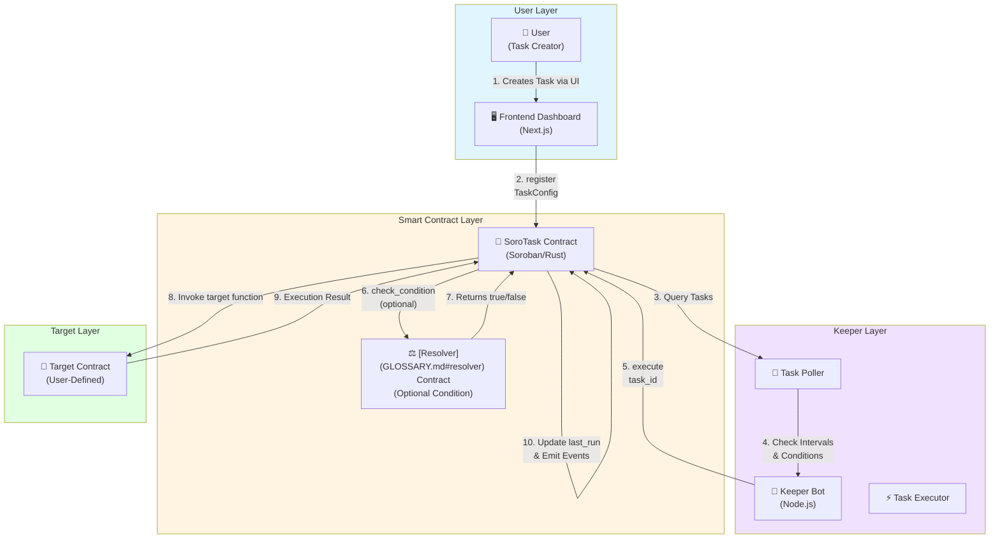
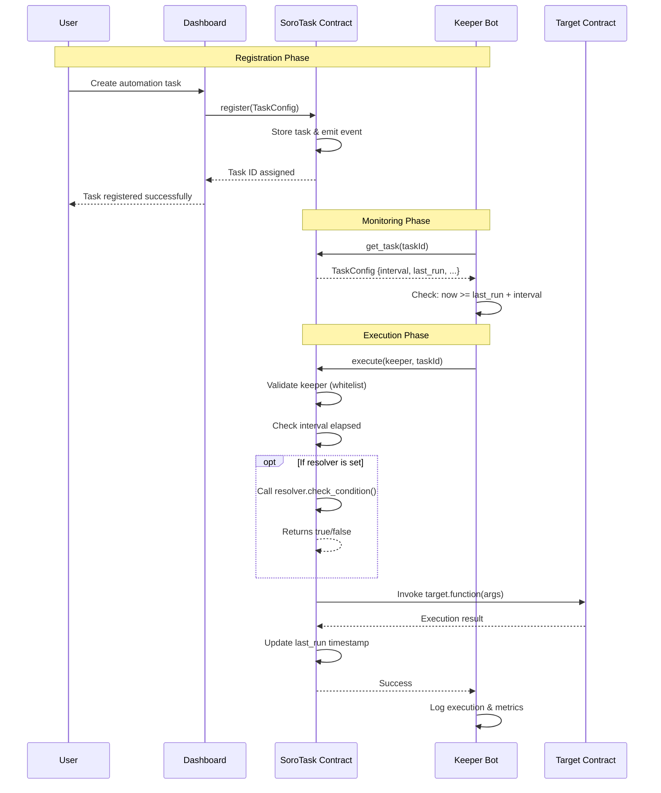

# SoroTask

[](https://github.com/SoroLabs/SoroTask/actions/workflows/keeper.yml)
[](https://github.com/SoroLabs/SoroTask/actions/workflows/rust.yml)

SoroTask is a decentralized automation marketplace on Soroban. It allows users to schedule recurring tasks (like yield harvesting) and incentivizes [Keepers](GLOSSARY.md#keeper) to execute them.

See the [Glossary](GLOSSARY.md) for definitions of terms used in this project.

## Project Structure

- **`/contract`**: Soroban smart contract (Rust).
  - Contains [`TaskConfig`](GLOSSARY.md#taskconfig) struct and core logic.
- **`/keeper`**: Off-chain bot (Node.js).
  - Monitors the network and executes due tasks.
- **`/frontend`**: Dashboard (Next.js + Tailwind).
  - Interface for task creation and management.

## Setup Instructions

### Quick Start with Docker (Recommended)

The fastest way to run a Keeper is using Docker:

```bash
# 1. Configure environment
cp keeper/.env.example keeper/.env
# Edit keeper/.env with your settings

# 2. Start the keeper
docker compose up -d

# 3. Check status
docker compose logs -f keeper
curl http://localhost:3001/health
```

See [keeper/README.md](keeper/README.md) for detailed Docker deployment documentation.

### Manual Setup

### 1. Smart Contract

```bash
cd contract
cargo build --target wasm32-unknown-unknown --release
```

### 2. Keeper Bot

```bash
cd keeper
npm install
node index.js
```

### 3. Frontend Dashboard

```bash
cd frontend
npm run dev
```

## Architecture

### System Overview

The SoroTask ecosystem operates through a coordinated loop between Users, the Smart Contract, Keepers, and Target Contracts:



### Component Interaction Flow



### Architecture Summary

1. **Register**: User registers a task via Contract.
2. **Monitor**: [Keepers](GLOSSARY.md#keeper) scan for due tasks.
3. **Execute**: Keeper executes the task and gets his [Incentive](GLOSSARY.md#incentive).

## Git Hooks

This project uses [Husky](https://typicode.github.io/husky/) and [lint-staged](https://github.com/lint-staged/lint-staged) to enforce code quality automatically on every commit.

**What runs on `git commit`:**
- `eslint --fix` + `prettier --write` on all staged `.js`, `.jsx`, `.ts`, and `.tsx` files.
- `prettier --write` on all staged `.json`, `.md`, `.yml`, and `.yaml` files.

Only staged files are processed, so commits stay fast regardless of monorepo size.

**Setup** (first time after cloning):
```bash
npm install
```
The `prepare` script runs `husky` automatically, installing the hooks.

**Bypassing hooks** (emergency use only):
```bash
git commit -m "your message" --no-verify
```
> ⚠️ Use `--no-verify` sparingly. It skips all pre-commit checks and should only be used when absolutely necessary.

## Monitoring

The Keeper exposes HTTP endpoints for health checks and operational metrics.

### Health Check

**Endpoint**: `GET /health`
**Port**: `3001` (configurable via `METRICS_PORT`)

Returns the current health status of the Keeper process.

**Response** (200 OK):

```json
{
  "status": "ok",
  "uptime": 3600,
  "lastPollAt": "2024-01-15T10:30:00.000Z",
  "rpcConnected": true
}
```

**Response** (503 Service Unavailable):

```json
{
  "status": "stale",
  "uptime": 3600,
  "lastPollAt": "2024-01-15T10:25:00.000Z",
  "rpcConnected": false
}
```

The endpoint returns `503` if the last poll timestamp is older than `HEALTH_STALE_THRESHOLD_MS` (default: 60000ms).

### Metrics

**Endpoint**: `GET /metrics`
**Port**: `3001` (configurable via `METRICS_PORT`)

Returns operational statistics for monitoring task execution performance.

**Response** (200 OK):

```json
{
  "tasksCheckedTotal": 1250,
  "tasksDueTotal": 45,
  "tasksExecutedTotal": 42,
  "tasksFailedTotal": 3,
  "avgFeePaidXlm": 0.0001234,
  "lastCycleDurationMs": 1523
}
```

**Metrics**:

- `tasksCheckedTotal`: Total number of tasks checked across all polling cycles
- `tasksDueTotal`: Total number of tasks that were due for execution
- `tasksExecutedTotal`: Total number of successfully executed tasks
- `tasksFailedTotal`: Total number of failed task executions
- `avgFeePaidXlm`: Rolling average of transaction fees paid (XLM)
- `lastCycleDurationMs`: Duration of the most recent execution cycle (milliseconds)

**Note**: All metrics are in-memory and reset on process restart.

### Environment Variables

```bash
METRICS_PORT=3001                    # Port for metrics/health server (default: 3001)
HEALTH_STALE_THRESHOLD_MS=60000     # Health staleness threshold (default: 60000ms)
MAX_CONCURRENT_EXECUTIONS=3         # Max concurrent task executions (default: 3)
```
